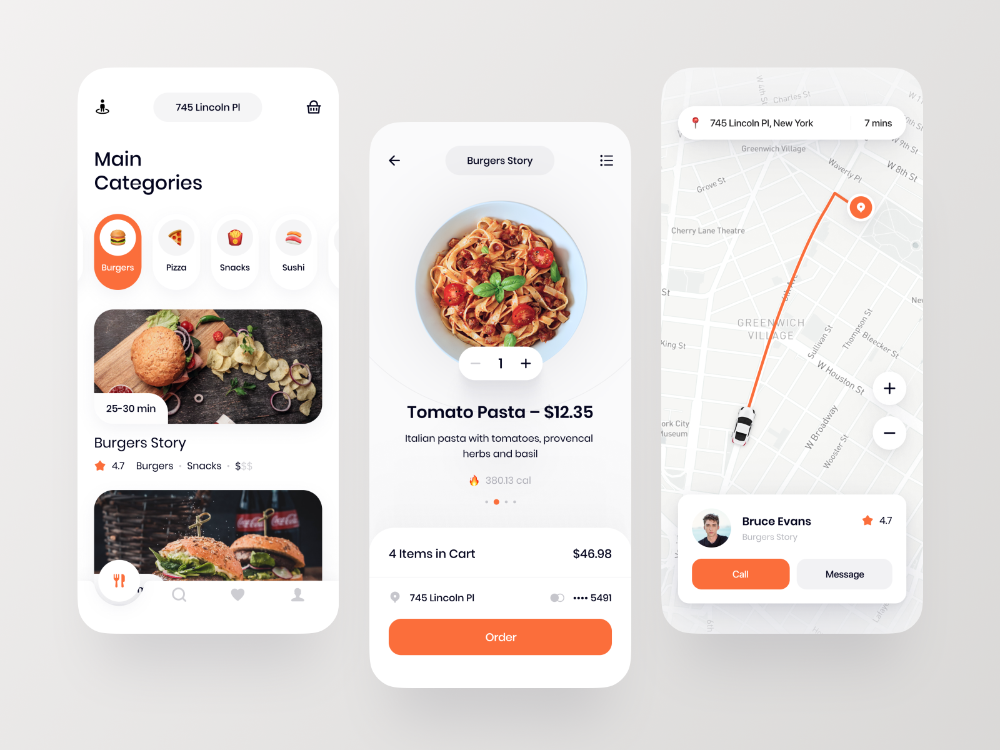

# FoodDelivery Online Application

> A beautiful food delivery app for use in online food commerce.

## Features

- Restaurants Listing
- Food Listing depending on category selected
- Adding to cart
- Auth
- Routing & Directions
- [Pending] Order Tracking
- [Pending] Admin Panel
- [Pending] Admin - Vendor - Customer Synching
- [Pending] Payment Gateways intergration
- [Pending] Push Notifications

## Coupled Apps

- <a> _[Coming Soon]_ Admin Panel (Web App)</a>

## User Interface

## Languages

- **Node.js & Express** => _For backend and API design_
- **React Native** => _iOS and Android App_
- **Reactjs** => _For a Web Version_